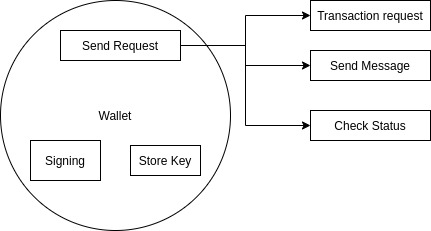

.. |nbsp| unicode:: U+00A0 .. non-breaking space

.. _api-wallet:

****************
Wallets & Signer
****************

**Wallet's** main functions are to:
 - Manage key, which will be used for encryption and decryption
 - Sign, encrypt transaction or message before it is sent through network provider
 - Send request to blockchain via network provider

-----

.. _wallet:

Wallet
######

The **wallet** implements the :ref:`Signer API <signer>` that can be used anywhere a *Signer*
is expected and has all the required properties.

Create Wallet
*************

:sup:`Wallet` . createRandom ( [ options ] ) |nbsp| `=> Wallet`
    | Creates a new random wallet, then generate mnemonic phrases and an encrypted JSON file.
    | Ensure this infomation is stored somewhere safe, there is **NO way to recover it** if lost. 

    | Parameters can be use are:
    
        - **entropyLength:** *int* (from 16 to 32 & mutiplications of 4—higher value means greater security)
        - **path:** *string* (directory to store mnemonic)
        - **locale:** *string* (wordlists)

        The current supported wordlists are:

    ===================== ===========================
    Language              node.js                    
    ===================== ===========================
    English (US)          ``wordlists.en`` 
    Spanish               ``wordlists.es``  
    France                ``wordlists.fr``        
    Italian               ``wordlists.it``           
    Japanese              ``wordlists.ja``           
    Korean                ``wordlists.ko``           
    Chinese (simplified)  ``wordlists.zh_cn``        
    Chinese (traditional) ``wordlists.zh_tw``        
    ===================== ===========================

.. warning:: 
        It is highly recommended to show mnemonic of the wallet to the users and advise them to write it down
        because there is **no way to recover** their wallet without the mnemonic phrases.

.. code-block:: javascript
    :caption: *create a new wallet using randomly generated private key*

    //By default, the wallet is created by 16 hexadecimal digits private key, 
    //and will generate mnemonic using wordlists.en
    let randomWallet = mxw.Wallet.createRandom();
    console.log("Address:", randomWallet.address);

    //expected result:
    //a random string, it will look something like this
    //mxw1duct5rv3wan3vpdk3ms6kgn0j8h905kqvccw4r

.. code-block:: javascript
    :caption: *create a new wallet randomly with specified private key length*

    // Create a wallet using 24 hexadecimal digits
    let randomWallet = mxw.Wallet.createRandom({
        entropyLength: 24
    });
    console.log("Address:", randomWallet.hexAddress);
    //expected result:
    //a random hexstring, it will looks something like this
    //0xd450137C0b463260F7Ef77177288De3976078129

.. code-block:: javascript
    :caption: *create a new wallet randomly and generate mnemonic using different wordlist*

    // Create a wallet and generate mnemonic using wordlists.zh
    let randomWallet = mxw.Wallet.createRandom({
        locale: mxw.wordlists.zh
    });
    console.log("Mnemonic:", randomWallet.mnemonic);
    //expected result:
    //Mnemonic: "followed by 12 random Chinese words"

.. note:: There is no way to differentiate or know how many digits are used to create the wallet.

Create Instance of Existing Wallet
==================================

There are 3 ways to load a wallet: private key, mnemonic, and JSON file. If a user doesn't have any
one of these, it is **impossible** to recover the wallet.

new :sup:`Wallet` ( privateKey [ , provider ] )
    Creating a new instance of existing wallet from *private key* and connect a provider (optional).

.. code-block:: javascript
    :caption: *load wallet using private key and connect to provider*

    //connect wallet to localnet
    let privateKey = "0x0123456789abcdef0123456789abcdef0123456789abcdef0123456789abcdef";
    let networkProvider = mxw.getDefaultProvider("localnet");
    let walletWithProvider = new mxw.Wallet(privateKey, provider);

.. _wallet-connect:

:sup:`prototype` . connect ( provider ) |nbsp| `=> Wallet`
    Creates a new wallet instance from an existing instance, connect to a new *provider*.

.. code-block:: javascript
    :caption: *load wallet using private key and connect to provider*

    //load wallet using private key
    let privateKey = "0x0123456789abcdef0123456789abcdef0123456789abcdef0123456789abcdef";
    let wallet = new mxw.Wallet(privateKey);

    // Connect the wallet to localnet
    let networkProvider = mxw.getDefaultProvider("localnet");
    wallet.connect(provider);

.. _fromEncryptedJson:

:sup:`Wallet` . fromEncryptedJson ( json, password [ , progressCallback ] ) |nbsp| `=> Wallet`
    Creating a new instance of existing wallet by decrypting an encrypted Secret Storage `JSON Wallet`_ (from created from *prototype.encrypt*).

.. code-block:: javascript
    :caption: *load wallet using an encrypted JSON*

    let data = {
        address: "mxw1x7tp9tt7mu0jm6qdmljgntvzzp53lrtndr7h8x",
        id: "0a462eb4-939d-4d05-acb1-f7827f758e3c",
        version: 3,
        Crypto: {
            cipher: "aes-128-ctr",
            cipherparams: {
                iv: "ff1e5fd9e71497a11e2923e7a2496bb9"
            },
            ciphertext: "6caeb28cf0687c9c84d5f02dab1afe3f27fb85483f90538ca59d299c5f2d426f",
            kdf: "scrypt",
            kdfparams: {
                salt: "8e8462bc7808066ba66d85fb85111906665b04b2320b5e7ac615d81e4f0641b5",
                n: 131072,
                dklen: 32,
                p: 1,
                r: 8
            },
            mac: "b7927c99583d62ec2426220fc5b65872aa89183227def48fd7b150b566c12142"
        },
        x-mxw: {
            client: "mxw-sdk",
            filename: "UTC--2019-07-25T16-24-39.0Z--mxw1x7tp9tt7mu0jm6qdmljgntvzzp53lrtndr7h8x",
            mnemonicCounter: "0de98c10a68756d8d7c51f4460f9d2cb",
            mnemonicCiphertext: "a31bb80eecb99a44eddbb53897e74f38",
            path: "m/44'/376'/0'/0/0",
            version: "0.1"
        }
    };

    let json = JSON.stringify(data);
    let password = "any strong password";

    mxw.Wallet.fromEncryptedJson(json, password).then((wallet) => {
        console.log("Wallet: " + wallet.address);
        // expected result:
        // mxw1x7tp9tt7mu0jm6qdmljgntvzzp53lrtndr7h8x
    });

:sup:`Wallet` . fromMnemonic ( mnemonic [ , path :sup:`= "m/44'/376'/0'/0/0"` [ , wordlist ] ] ) |nbsp| `=> Wallet`
    Generates a `BIP-039`_ + `BIP-044`_ wallet from *mnemonic* deriving *path* using
    the *wordlist*. The default language is English (en).

.. code-block:: javascript
    :caption: *load a wallet using mnemonic phrase*

    let mnemonic = "legal grain canyon open antenna flame destroy nature fall pistol mushroom stay";
    let mnemonicWallet = mxw.Wallet.fromMnemonic(mnemonic);
    console.log("mnemonicWallet: " + mnemonicWallet.address);
    // expected result:
    // mnemonicWallet: mxw1x7tp9tt7mu0jm6qdmljgntvzzp53lrtndr7h8x

    // Load the second account from a mnemonic
    let path = "m/44'/376'/1'/0/0";
    let secondMnemonicWallet = mxw.Wallet.fromMnemonic(mnemonic, path);
    console.log("secondMnemonicWallet: " + secondMnemonicWallet.address);
    // expected result:
    // secondMnemonicWallet: mxw1lgz72w89amz76vrnl3mgfj4p9jls7eggts0pag

    // Load using a non-english locale wordlist (the path "null" will use the default)
    let zhMnemonic = "手 农 勾 讲 嫂 蒋 借 棚 遗 没 紫 雾";
    let zhMnemonicWallet = mxw.Wallet.fromMnemonic(zhMnemonic, null, mxw.wordlists.zh);
    console.log("zhMnemonicWallet: " + zhMnemonicWallet.address);
    // expected result:
    // zhMnemonicWallet: mxw1j4yh2gfumy8d327n0uvztg9075fjzd59vxf9ae

-----

.. _addressOrName:

Prototype Variables
*******************
These are the variables you can get from wallet.

:sup:`prototype` . address
    | Returns public address of a wallet.
    | *data type: string*

:sup:`prototype` . privateKey
    | Returns private key of a wallet; always keep this secret.
    | *data type: hex string*

:sup:`prototype` . provider
    Returns a connected :ref:`Provider <provider>` which allows the wallet to
    connect to the blockchain network to query its state and send transactions, 
    or null if no provider is connected.

    To change the provider, use the :ref:`connect <wallet-connect>` method, which will return
    a **new instance** of the wallet connected to the provider.

    | *data type: string*

:sup:`prototype` . mnemonic
    | Returns mnemonic phrase for this wallet, or null if the mnemonic is unknown.
    | *data type: string*

:sup:`prototype` . path
    | Returns mnemonic path for this wallet, or null if the mnemonic is unknown.
    | *data type: string* 

-----

Signers
#######

Signer is required to add a layer of security in a transaction, ensuring no one can manipulate other's wallet 

Signing
*******
An encryption process using user's own private key. When sending message or transaction to
another wallet, it will be encryted again using their public key. 

:sup:`prototype` . signMessage ( message ) |nbsp| `=> Promise<string>`
    Signs *message* and returns a :ref:`Promise <promise>` that resolves to
    the :ref:`flat-format <signature>` signature.

    If *message* is a string, it is converted to UTF-8 bytes, otherwise it is
    preserved as a binary representation of the :ref:`Arrayish <arrayish>` data.

.. code-block:: javascript
    :caption: *sign text messages*

    let privateKey = "0xca250aeca008d36b4b4ff83709343c9e4c4ea461e5aa5fa51d57a0fe11eb045e";
    let wallet = new mxw.Wallet(privateKey);

    // Sign a text message
    return wallet.signMessage("Hello Blockchain!").then((signature) => {

        // Flat-format
        console.log(signature);
        // expected result:
        // 0xc49045d2fd3f591c86b1c35ed90315f6b42791401854c5164461946c8f5fea98
        //   0229683de3459716cd7d1e5f9502811766a5eaf9c96c64c1625aaad815cdc3741c

        // Expanded-format
        console.log(mxw.utils.splitSignature(signature));
        // expected result:
        // { 
        //     r: "0xc49045d2fd3f591c86b1c35ed90315f6b42791401854c5164461946c8f5fea98",
        //     s: "0x0229683de3459716cd7d1e5f9502811766a5eaf9c96c64c1625aaad815cdc374",
        //     v: 28,
        //     recoveryParam: 1
        // }
    });

.. code-block:: javascript
    :caption: *sign binary messages*

    let privateKey = "0xca250aeca008d36b4b4ff83709343c9e4c4ea461e5aa5fa51d57a0fe11eb045e";
    let wallet = new mxw.Wallet(privateKey);

    // The 66-character hex string MUST be converted to a 32-byte array first!
    let hash = "0x48656c6c6f20426c6f636b636861696e21";
    let binaryData = mxw.utils.arrayify(hash);

    wallet.signMessage(binaryData).then((signature) => {

        console.log(signature);
        // expected result:
        // "0xc49045d2fd3f591c86b1c35ed90315f6b42791401854c5164461946c8f5fea98
        //    0229683de3459716cd7d1e5f9502811766a5eaf9c96c64c1625aaad815cdc3741c

        let address = mxw.utils.verifyMessage(binaryData, signature);
        console.log(address);
        // expected result:
        // Should be equal to the signer's wallet address: mxw1x7tp9tt7mu0jm6qdmljgntvzzp53lrtndr7h8x
    });

:sup:`prototype` . sign ( transaction ) |nbsp| `=> Promise<string>`
    Signs *transaction* and returns a :ref:`Promise <promise>` that resolves to
    the signed transaction as a :ref:`hex string <hexstring>`.

    In general, the `sendTransaction`_ method is preferred to ``sign``, as it can automatically
    populate values asynchronously.

    Check out :ref:`Transactions <transaction>` and :ref:`Transaction Reciepts <transaction-receipt>` for more details.

.. code-block:: javascript
    :caption: *sign transactions*

    let privateKey = "0xca250aeca008d36b4b4ff83709343c9e4c4ea461e5aa5fa51d57a0fe11eb045e";
    let networkProvider = mxw.getDefaultProvider("localnet");
    let wallet = new mxw.Wallet(privateKey, provider);

    console.log(wallet.address);
    // expected result:
    // "mxw1x7tp9tt7mu0jm6qdmljgntvzzp53lrtndr7h8x"

    let amount = mxw.utils.parseMxw("1.0");

    // All properties are optional, except fee
    let transaction = {
        type: "cosmos-sdk/StdTx",
        value: {
            msg: [
                {
                    type: "mxw/MsgSend",
                    value: {
                        amount: [
                            {
                                amount: amount,
                                denom: "cin",
                            },
                        ],
                        from_address: wallet.address,
                        to_address: "mxw1j4yh2gfumy8d327n0uvztg9075fjzd59vxf9ae",
                    }
                }
            ],
            memo: "Hello Blockchain"
        },
        fee: provider.getTransactionFee("bank", "bank-send")
    };

    wallet.sign(transaction).then((signedTransaction) => {

        console.log(signedTransaction);
        // Should be Base64 encoded string

        provider.sendTransaction(signedTransaction).then((tx) => {

            console.log(tx);
            // Should be transaction response with transaction hash value

            // Query transaction receipt by transaction hash
            provider.waitForTransaction(tx.hash).then((receipt) => {

                console.log(receipt.status);
                //expected result:
                //1 (means success)
            });
        });
    });

-----

Cryptographic Functions
***********************

Shared secret is used when two parties agree on sharing their asset inside a blockchain.
After a shared secret is computed, it will return as a hex string. The hex string can be used for 
authentication purpose of any operations involved in their asset sharing.

:sup:`prototype` . computeSharedSecret ( otherPublicKey ) |nbsp| `=> hex string`
    Computes the *shared secret* by using receiving wallet's public key and return it as a :ref:`hex string <hexstring>`.
    In general, the shared secret should not be used directly as encryption key. Instead, it can be derived it using 
    Password-Based Key Derivation Function 2 :ref:`(PBKDF2) <pbkdf2>`.

.. code-block:: javascript
    :caption: compute shared secret using sender's own private key and receiving wallet's public key

    let wallet = mxw.Wallet.createRandom();
    let otherWallet = mxw.Wallet.createRandom();
    console.log(wallet.computeSharedSecret(otherWallet.publicKey));
    //expected result:
    //a hex string, something like this
    //0xcdfa6c550d930fa45b9f938a96a3b76c90e1f90fed7ffd8bbcc6dbd566316e88
    
-----

Blockchain Operations
*********************

These operations require wallet to be connected to blockchain by a network provider.

:sup:`prototype` . getBalance ( ) |nbsp| `=> Promise<BigNumber>`
    Returns a :ref:`Promise <promise>` that resolves to the balance of the wallet (as a :ref:`BigNumber <bignumber>`,
    in **cin**). Be aware that the number of decimals for *cin* is 18.
    The balance can be converted to a human-readable format by :ref:`formatMXW <formatMxw>`, versa :ref:`parseMXW <parseMxw>`.

.. code-block:: javascript
    :caption: check wallet balance

        let networkProvider = mxw.getDefaultProvider("localnet");
        let privateKey = "0x0000000000000000000000000000000000000000000000000000000000000001";
        let wallet = new mxw.Wallet(privateKey,provider);
        wallet.getBalance().then((balance)=>{
            console.log(mxw.utils.formatMxw("Wallet balance: " + balance));
        });
        // Expected result
        // Wallet balance: 0.0

:sup:`prototype` . getTransactionCount ( ) |nbsp| `=> Promise<BigNumber>`
    Returns a :ref:`Promise <promise>` that resolves to the number of transactions
    this account has ever sent (as a :ref:`BigNumber <bignumber>`).

.. code-block:: javascript
    :caption: *query the network*

    // We require a provider to query the network
    let networkProvider = mxw.getDefaultProvider("localnet");

    let privateKey = "0x0123456789abcdef0123456789abcdef0123456789abcdef0123456789abcdef";
    let wallet = new mxw.Wallet(privateKey, provider);

    wallet.getBalance().then((balance) => {
        console.log("Balance: " + mxw.utils.formatMxw(balance));
        //expected result:
        //Balance: 0.0
    });

    wallet.getTransactionCount().then((nonce) => {
        console.log("Transaction Count: " + mxw.utils.formatMxw(nonce));
        //expected result:
        //Transaction Count: 0.0
    });

:sup:`prototype` . transfer ( :ref:`AddressOrName <addressOrName>`, value ) |nbsp| `=> Promise<TransactionReceipt>`
    Sends the *transfer transaction* to the network and returns a :ref:`Promise <promise>` that resolves to a
    :ref:`Transaction Receipt <transaction-receipt>`.

    The :ref:`AddressOrName <addressOrName>` can be set to recipient's alias or wallet address. The ``value`` is the number of *cin*
    (as a :ref:`BigNumber <bignumber>`) that is being transferred to recipient. Be aware that the number of decimals for *cin*
    is 18.

.. code-block:: javascript
    :caption: *transfer MXW*

    // We require a provider to send transactions
    let networkProvider = mxw.getDefaultProvider("localnet");

    let privateKey = "0x0123456789abcdef0123456789abcdef0123456789abcdef0123456789abcdef";
    let wallet = new mxw.Wallet(privateKey, provider);

    let to = "mxw1j4yh2gfumy8d327n0uvztg9075fjzd59vxf9ae";
    // ... or supports alias names
    // to: "jeansoon",

    let amount = mxw.utils.parseMxw("1.0");
    // We must pass in the amount as cin (1 MXW = 1e18 cin), so we
    // use this convenient function to convert MXW to cin.

    wallet.transfer(to, amount).then((receipt) => {
         console.log(receipt.status);
        //expected result:
        //1 (means success)
    });

.. _sendTransaction:

:sup:`prototype` . sendTransaction ( transaction ) |nbsp| `=> Promise<TransactionResponse>`
    Sends the *transaction* (see :ref:`Transaction Requests <transaction-request>`) to
    the network and returns a :ref:`Promise <promise>` that resolves to a
    :ref:`Transaction Response <transaction-receipt>`. Any properties that are not
    provided will be populated from the network.

-----

Encrypted JSON Wallets
**********************

Many systems store private keys as encrypted JSON wallets, in various formats. There are several
formats and algorithms that are used, all of which are supported to be read.
Only the secure scrypt variation can be generated.

See :ref:`Wallet.fromEncryptedJson <fromEncryptedJson>` for creating a
wallet instance from a JSON wallet.

:sup:`prototype` . encrypt ( password [ , options [ , progressCallback ] ] ) |nbsp| `=> Promise<string>`
    Encrypts the wallet as an encrypted JSON wallet, with the *password*.

    All options are optional. The valid options are:

        - **salt** --- the salt to use for scrypt
        - **iv** --- the initialization vector to use for AES-CTR-128
        - **uuid** --- the UUID to use for the wallet
        - **scrypt** --- the scrypt parameters to use (N, r, and p)
        - **entropy** --- the mnemonic entropy of this wallet; generally you should **not** specify this
        - **mnemonic** --- the mnemonic phrase of this wallet; generally you should **not** specify this
        - **path** --- the mnemonic path of this wallet; generally you should **not** specify this

    If the *progressCallback* is specified, it will be called periodically during
    encryption with a value between 0 and 1, inclusive of indicating the progress.

.. code-block:: javascript
    :caption: *encrypt a wallet as an encrypted JSON wallet*

    let password = "any strong password";

    function callback(progress) {
        console.log("Encrypting: " + parseInt(progress * 100) + "% complete");
    }

    return wallet.encrypt(password, callback).then((json) => {
        console.log(json);
        // expected result:
        // a JSON text contains address, ID, and various info of the wallet.
    });

-----

.. _signer:

Signer API
**********

The Signer API is an abstract class which makes it easy to extend and add new signers,
that can be used by this library and extension libraries. The :ref:`wallet <wallet>`
extends the Signer API.

To implement a signer, inherit the abstract class *mxw.types.Signer* and implement
the following properties:

:sup:`object` . provider
    Returns :ref:`Provider <api-provider>` that is connected to the network. This is optional, however,
    without a *provider*, **only** *write-only* operations should be expected to work.

:sup:`object` . getAddress ( ) |nbsp| `=> Promise<Address>`
    Returns a :ref:`Promise <promise>` that resolves to the account address.

:sup:`object` . signMessage ( message ) |nbsp| `=> Promise<hex>`
    Returns a :ref:`Promise <promise>` that resolves to the :ref:`Flat-Format Signature <signature>`
    for the *message*.

    If *message* is a string, it is converted to UTF-8 bytes, otherwise it is
    preserved as a binary representation of the :ref:`Arrayish <arrayish>` data.

:sup:`object` . sign ( transaction ) |nbsp| `=> Promise<hex>`
    Returns a :ref:`Promise <promise>` that resolves to the *signed* transaction that is ready to be sent to the network.

:sup:`object` . sendTransaction ( transaction ) |nbsp| `=> Promise<TransactionResponse>`
    Sends the *transaction* (see :ref:`Transaction Requests <transaction-request>`) to
    the network and returns a :ref:`Promise <promise>` that resolves to a
    :ref:`Transaction Response <transaction-receipt>`. Any properties that are not
    provided will be populated from the network.

-----

.. _BIP-039: https://github.com/bitcoin/bips/blob/master/bip-0039.mediawiki
.. _BIP-044: https://github.com/bitcoin/bips/blob/master/bip-0044.mediawiki
.. _JSON Wallet: https://medium.com/@julien.maffre/what-is-an-ethereum-keystore-file-86c8c5917b97
.. EOF