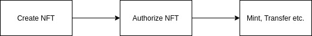

.. |nbsp| unicode:: U+00A0 .. non-breaking space

.. _api-nft:

******************
Non-Fungible Token
******************

A non-fungible token (NFT) is a special type of cryptographic token which represents something unique; non-fungible 
tokens are thus not mutually interchangeable by their individual specification. This is in contrast with 
cryptocurrencies like Zcash, and many network or utility tokens that are fungible in nature.

-----

General Workflow
################

Firstly, a non-fungible token must be created. It can be created by any wallet, but
it has to be authorized through a KYC process before it can be used.

*Authorization might get rejected.*

Creating Instances
##################
Creating non-fungible token requires approval from authorities.

:sup:`NonFungibleToken` . create ( nonFungibleTokenProperties, signerOrProvider ) |nbsp| `=> Promise<NonFungibleToken>`
    Creates a new instance reference from *signerOrProvider*, then sends non fungible token creation transaction to network
    and returns a :ref:`Promise <promise>` that resolves to a NonFungibleToken instance.

    The valid non-fungible token properties are:

        - **name:** *string* (name of the token)
        - **symbol:** *string* (symbol of the token)
        - **fee:** *int* (application fee)
        - **properties:** *string* (properties of the token)
        - **metadata:** *string* (remarks) 

    .. note:: 
        | Token name and symbol must be unique; 
        | metadata can be changed after the token is created, but not properties.

.. code-block:: javascript
    :caption: create non-fungible token

    let provider = new mxw.Wallet(0x00000000000000000000000000000000000000000000000070726f7669646572);
    let nonFungibleTokenProperties: NonFungibleTokenProperties;
    nonFungibleTokenProperties = {
        name: "MY " + "symbol",
        symbol: "symbol",
        fee: {
            to: "address",
            value: bigNumberify("1")
        },
        metadata: ["Wallet able to manage their own metadata"],
        properties:["Decentralised identifier"]
    };

    var nonFungibleToken = new NonFungibleToken("symbol", provider);
    nonFungibleToken.create(nonFungibleTokenProperties, provider).then((token) => {
        console.log(JSON.stringify(token));
    });

:sup:`NonFungibleToken` . fromSymbol ( symbol, signerOrProvider ) |nbsp| `=> Promise<NonFungibleToken>`
    Queries non-fungible token by symbol from network and returns a :ref:`Promise <promise>` that 
    resolves to a NonFungibleToken instance.

.. code-block:: javascript
    :caption: check token state

        mxw.nonFungibleToken.NonFungibleToken.fromSymbol("symbol","issuer address").then((token)=>{
            console.log(JSON.stringify(token));
        });  

-----

Prototype
*********

:sup:`prototype` . state |nbsp| `=> NFTokenState`

    | (Read-only)
    | The valid token states are:

        - **flags** --- *uint* (number)
        - **name** --- *string* (unique token name)
        - **symbol** ---*string* (unique token symbol)
        - **owner** --- *sting* (token owner's address)
        - **newOwner** --- *string* (token receiver's address)
        - **metadata** --- *string* (metadata/remarks of token) 
        - **mintLimit** --- *BigNumber* (token's maximum mint limit of token)
        - **transferLimit** --- *BigNumber* (token's maximum transfer limit)
        - **endorserList** --- *string[]* list of endorsers 
        - **totalSupply** --- *BigNumber* (total items minted by the token)

.. note:: All token must be authorized, before it can use to mint item or transfer ownership. All token state must be assigned.

.. code-block:: javascript
    :caption: authorize token

        let provider = new mxw.Wallet(0x00000000000000000000000000000000000000000000000070726f7669646572);
        let issuer = new mxw.Wallet(0x0000000000000000000000000000000000000000000000000000697373756572);
        let middleware = new mxw.Wallet(0x000000000000000000000000000000000000000000006d6964646c6577617265);

        let tokenState = {
        tokenFees: [
                    { action: NonFungibleTokenActions.transfer, feeName: "default" },
                    { action: NonFungibleTokenActions.transferOwnership, feeName: "default" },
                    { action: NonFungibleTokenActions.acceptOwnership, feeName: "default" }
                    ],
        endorserList: [],
        mintLimit: 1,
        transferLimit: 1,
        burnable: false,
        pub: false
        };

        token.NonFungibleToken.approveNonFungibleToken("symbol",provider, tokenState).then((transaction) => {
            token.NonFungibleToken.signNonFungibleTokenStatusTransaction(transaction, issuer).then((transaction) => {
                token.NonFungibleToken.sendNonFungibleTokenStatusTransaction(transaction, middleware).then((receipt) => {
                    console.log("approve"+receipt);
                });
            });
        });

:sup:`prototype` . transferOwnership ( :ref:`AddressOrName <addressOrName>` ) |nbsp| `=> Promise<TransactionReceipt>`
    Sends the *transfer non-fungible token* to another person and returns a :ref:`Promise <promise>` that resolves to a
    :ref:`Transaction Receipt <transaction-receipt>`.

.. code-block:: javascript
    :caption: transfer item ownership

        let provider = new mxw.Wallet(0x00000000000000000000000000000000000000000000000070726f7669646572);
        let privateKey = "0x0123456789abcdef0123456789abcdef0123456789abcdef0123456789abcdef";
        let wallet = new mxw.Wallet(privateKey, provider);

        var nonFungibleToken = new NonFungibleToken(symbol, provider);
        nonFungibleToken.transfer(wallet.address).then((receipt) => {
            console.log(JSON.stringify(receipt));
        })

:sup:`prototype` . mint ( :ref:`AddressOrName <addressOrName>`, NonFungibleTokenItem) |nbsp| `=> Promise<TransactionReceipt>`
    Sends the *mint non-fungible token transaction* to the network and returns a :ref:`Promise <promise>` that resolves to a
    :ref:`Transaction Receipt <transaction-receipt>`.

    The :ref:`AddressOrName <addressOrName>` can be set to recipient's alias or wallet address. 

.. code-block:: javascript
    :caption: *mint an NFT item*

        let issuer : mxw.Wallet;
        let item = {
            symbol: "symbol",
            itemID: "itemId",
            properties: "prop1",
            metadata: "str1"
        } ;

        var minterNFT = new NonFungibleToken(symbol, issuer);

        minterNFT.mint(issuer.address, item).then((receipt) => {
            console.log(JSON.stringify(receipt));
        });

.. note:: Symbol of the minted item must be the same as the token symbol.

:sup:`prototype` . updateMetadata(*string* metadata) |nbsp| `=> Promise<TransactionReceipt>`
    Update the *metadata of NFT or NFT item* to the network and returns a :ref:`Promise <promise>`.

.. code-block:: javascript
    :caption: *update metadata of an NFT*

    let provider = new mxw.Wallet(0x00000000000000000000000000000000000000000000000070726f7669646572);
    let nonFungibleTokenProperties: NonFungibleTokenProperties;
    nonFungibleTokenProperties = {
        name: "MY " + symbol,
        symbol: symbol,
        fee: {
            to: nodeProvider.nonFungibleToken.feeCollector,
            value: bigNumberify("1")
        },
        metadata: ["Wallet is able to manage their own metadata"],
        properties:["Decentralised identifier"]
    };

    let nftInstance = new NonFungibleTokenItem(nonFungibleTokenProperties,provider);

    //overwrite the token metadata with string "overwrite"
    nftInstance.updateMetadata("overwite").then((receipt) => {
            console.log(JSON.stringify(receipt));
    });

    //adding new info into the token metadata
    let nftItemStatus = nftInstance.getState();
    nftInstance.updateMetadata(nftItemStatus.metadata + "overwrite").then((receipt) => {
            console.log(JSON.stringify(receipt));
    });

-----

Additional Actions
******************
Freeze and unfreeze an item.

.. code-block:: javascript
    :caption: freeze item

        let provider = new mxw.Wallet(0x00000000000000000000000000000000000000000000000070726f7669646572);
        let issuer = new mxw.Wallet(0x0000000000000000000000000000000000000000000000000000697373756572);
        let middleware = new mxw.Wallet(0x000000000000000000000000000000000000000000006d6964646c6577617265);

        token.NonFungibleToken.freezeNonFungibleTokenItem("symbol","itemID",provider).then((transaction) => {
            token.NonFungibleToken.signNonFungibleTokenItemStatusTransaction(transaction, issuer).then((transaction) => {
                token.NonFungibleToken.sendNonFungibleTokenItemStatusTransaction(transaction, middleware).then((receipt) => {
                    console.log(JSON.stringify(receipt));
                });
            });
        }); 

.. code-block:: javascript
    :caption: unfreeze item

        let provider = new mxw.Wallet(0x00000000000000000000000000000000000000000000000070726f7669646572);
        let issuer = new mxw.Wallet(0x0000000000000000000000000000000000000000000000000000697373756572);
        let middleware = new mxw.Wallet(0x000000000000000000000000000000000000000000006d6964646c6577617265);

        token.NonFungibleToken.unfreezeNonFungibleTokenItem("symbol","itemID",provider).then((transaction) => {
            token.NonFungibleToken.signNonFungibleTokenItemStatusTransaction(transaction, issuer).then((transaction) => {
                token.NonFungibleToken.sendNonFungibleTokenItemStatusTransaction(transaction, middleware).then((receipt) => {
                    console.log(JSON.stringify(receipt));
                });
            });
        }); 

------

Item
####
Create an item instance, three components must be included: symbol, itemId, and address of issuer.

:sup:`prototype`. getState() |nbsp| `=> NFTokenState`
    Returns to the state of Non-fungible Token Item status

    | (Read-only)
    | The valid token state are:

        - **symbol** --- symbol of the NFT item
        - **itemID** --- ID of the NFT item
        - **properties** --- properties of the NFT item
        - **metadata** --- metadata of the NFT item

.. code-block:: javascript
    :caption: get item status

        nftInstance.getState().then((result)=>{
            console.log(JSON.stringify(result));
        });

:sup:`NonFungibleTokenItem` . fromSymbol ( symbol, itemID, signerOrProvider ) |nbsp| `=> Promise<NonFungibleToken>`
    Queries NFT item by symbol from network and returns a :ref:`Promise <promise>` that 
    resolves to a NonFungibleToken instance.

.. code-block:: javascript
    :caption: check on item state

        mxw.nonFungibleToken.NonFungibleToken.fromSymbol("symbol","itemID","issuer address").then((token)=>{
            console.log(JSON.stringify(token))
        });  

.. code-block:: javascript
    :caption: get the state of token that minted this item

        mxw.nonFungibleToken.NonFungibleToken.fromSymbol("symbol","itemID","issuer address").then((token)=>{
            console.log(JSON.stringify(token))
            var mintedNFTItem = nftItem;
            console.log(mintedNFTItem.parent.state);
        });

:sup:`prototype` . burn () |nbsp| `=> Promise<TransactionReceipt>`
    Sends the *burn non-fungible token transaction* to the network and returns a :ref:`Promise <promise>` that resolves to a
    :ref:`Transaction Receipt <transaction-receipt>`. To burn item, the burn token flag must be true.

    The ``value`` is the number of *non-fungible token* (as a :ref:`BigNumber <bignumber>`) to be burned.
    Be aware of the number of decimals applied to the token.

.. code-block:: javascript
    :caption: *burn an NFT item*

        let nftInstance = new NonFungibleTokenItem(symbol, itemID, address);
        nftInstance.burn().then((receipt) => {
                console.log(receipt);
        });

:sup:`prototype` . endorse( ) |nbsp| `=> Promise<TransactionReceipt>`
    Sign/approves endorsement by an endorser

.. code-block:: javascript
    :caption: *endorse an NFT item*

    let nftInstance = new NonFungibleTokenItem("symbol", "itemID", "address");
    nftInstance.endorse().then((receipt) => {
            console.log(receipt);
    });

:sup:`prototype` . updateItemMetadata(metadata) |nbsp| `=> Promise<TransactionReceipt>`
    Updates the *metadata of NFT item* to the network and returns a :ref:`Promise <promise>`.

.. code-block:: javascript
    :caption: *update metadata of an NFT item*

    let nftInstance = new NonFungibleTokenItem("symbol", "itemID", "address");

    //overwrite the NFT item metadata with string "overwrite"
    nftInstance.updateItemMetadata("overwite").then((receipt) => {
            console.log(receipt);
    });

    //adding new info into the item metadata
    let nftItemStatus = nftInstance.getState(0);
    nftInstance.updateItemMetadata(nftItemStatus.metadata + "overwrite").then((receipt) => {
            console.log(receipt);
    });

