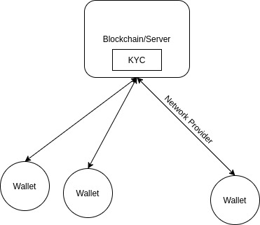

============
Introduction
============

Wallets are individual "accounts" created by each Maxonrow blockchain user.
Each wallet can request for different operations, transfer MXW, send message, and etc.

Each wallet is required to be connected by a network provider to the blockchain/server 
in order to run any blockchain-related operations (e.g., transfer, check  balance, etc.).

Inside the blockchain, it will pass through a verification process run by KYC before
any operation can be started. All wallets, tokens must run KYC once before they can be used 
in Maxonrow blockchain.